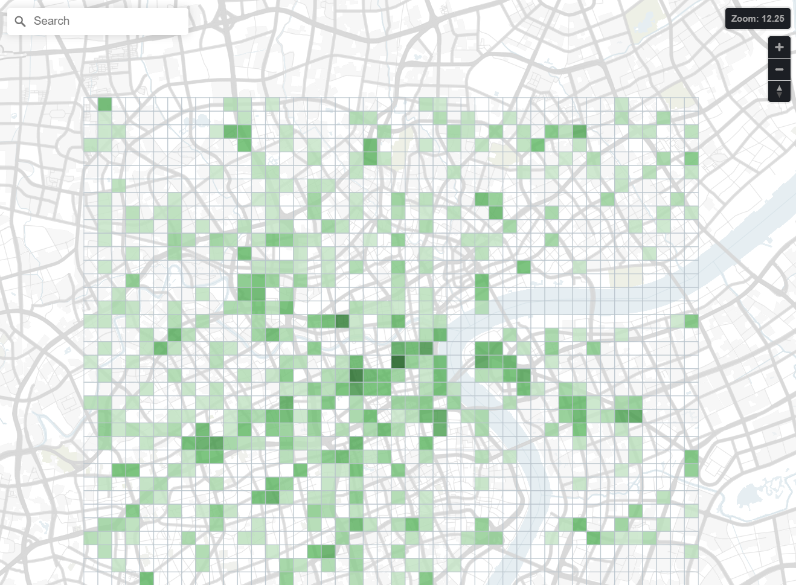

<h1 align="center">Maputnik AI</h1>

<p align="center"><strong>Talk to your map. Turn data into a visualization with one prompt.</strong></p>

<p align="center">
  <a href="#overview">English</a> · <a href="#中文说明">简体中文</a>
</p>

Maputnik AI lets you control a live MapLibre map with natural language. Choose a map style, add a CSV dataset, and describe the result you want—the AI can restyle the map, create a data visualization, and refine it with you in the same editable workspace.

<table>
  <tr>
    <td width="50%" valign="top">
      
    </td>
    <td width="50%" valign="top">
      
    </td>
  </tr>
  <tr>
    <td align="center"><strong>Tell AI how to edit the live map</strong></td>
    <td align="center"><strong>Generate a data visualization from one prompt</strong></td>
  </tr>
</table>

<a id="overview"></a>

## How it works

1. **Choose a map style.** Start from an available style or import your own MapLibre style as the base map.
2. **Add your data.** Upload a CSV, inspect its columns, and select the longitude and latitude fields.
3. **Ask the AI.** Describe the map or visualization you want in one prompt. You can also attach a reference image for the AI to follow.
4. **Export the result.** Refine the live result through chat or the visual editor, then export the base map, data overlay, or both as PNG files.

For example, after uploading a CSV with `lon`, `lat`, and `value` columns:

> Simplify the base map, then visualize the hotspot data as a green square grid whose color intensity represents `value`. Choose a suitable grid size for the current map scale.

## What the AI can do

- Inspect the live viewport, style, sources, layers, selected layer, clicked features, and loaded datasets.
- Modify the same live MapLibre map that is open in the visual editor—there is no separate preview or duplicate map state.
- Turn browser-local CSV data into point-based map layers and generate custom visual treatments with JavaScript.
- Follow attached reference images when used with a vision model, helping reproduce their colors, labels, hierarchy, and composition.
- Continue refining the result through conversation while keeping manual Maputnik editing available.
- Preserve local chat sessions, settings, and datasets, and export the base map and AI-created overlays separately.

## Quick start

Use the current active LTS release of Node.js or newer.

```bash
npm install
npm run start
```

Open <http://localhost:8889/maputnik/>.

## Configure the AI model

- The API endpoint must be compatible with the OpenAI **Responses API** and support streaming requests. An endpoint that only provides the Chat Completions API, such as `/v1/chat/completions`, cannot be used directly. The default OpenAI endpoint is `https://api.openai.com/v1/responses`; for another provider, enter its corresponding Responses API-compatible endpoint.
- The model needs reliable instruction-following, JavaScript generation, and tool-calling capabilities so it can inspect workspace state and iteratively modify the map.
- A vision model that supports image input is recommended. When a reference image is attached to the prompt, a vision model can analyze its colors, layer hierarchy, labels, and overall composition to more closely reproduce the reference map's appearance.
- Consider trying `deepseek-v4-flash-vision-exp`, or another Responses API-compatible vision model offered by your provider. Available model names, image-input capabilities, and tool-calling support depend on the provider.

After starting the app, select **Agent** in the top toolbar, open **Settings**, and enter the API key, Responses API endpoint, and model name.

## Runtime surface

The agent's `run_javascript` tool receives these live objects:

| Object | Purpose |
| --- | --- |
| `map` | The current MapLibre map and its native API |
| `style` | The editable MapLibre style object |
| `runtime` | Viewport, selection, style, and dataset-layer operations |
| `datasets` | Loaded CSV metadata and rows |
| `workspace` | A snapshot of the current editor state |
| `log` | Output returned to the agent conversation |

```js
const dataset = datasets.list()[0];

runtime.setViewport({
  center: [121.47, 31.23],
  zoom: 11,
});

runtime.addDatasetLayer(dataset.id, {
  geometry: {type: "Point", coordinates: ["lon", "lat"]},
  type: "circle",
  paint: {
    "circle-radius": 4,
    "circle-color": ["interpolate", ["linear"], ["to-number", ["get", "value"]], 0, "#d9f0d3", 10, "#238b45"],
  },
});
```

> [!WARNING]
> Agent-generated JavaScript currently executes in the page runtime and is not sandboxed. The API key and chat settings are stored in browser local storage. Use the agent only in a trusted local environment with trusted models, prompts, and data.

## Development

```bash
npm run build       # Type-check and build
npm run lint        # Lint TypeScript and React code
npm run lint-css    # Lint styles
npm run test-unit   # Run unit tests
```

End-to-end tests use Playwright and are the primary coverage signal for UI behavior:

```bash
# First run only
npx playwright install --with-deps chromium

# Playwright starts the development server automatically
npm run test
```

## Project background and license

Maputnik AI is an independent experimental fork, not an official MapLibre project. The original Maputnik editor is maintained at [maplibre/maputnik](https://github.com/maplibre/maputnik).

This repository preserves Maputnik's copyright notices and is distributed under the [MIT License](LICENSE).

---

<a id="中文说明"></a>

## 中文说明

Maputnik AI 让你可以直接用自然语言操控实时 MapLibre 地图。选择一个地图样式、导入 CSV 数据，再用一句话描述想要的效果，AI 就能修改地图样式、生成数据可视化，并在同一个可编辑工作区中继续与你一起调整。

### 使用流程

1. **选择地图样式。** 从现有样式开始，或导入自制的 MapLibre 样式作为底图。
2. **导入数据。** 上传 CSV、查看字段，并指定经度和纬度字段。
3. **告诉 AI 想要什么。** 用一句话描述地图或数据可视化效果；也可以附上参考图，让 AI 模仿其视觉风格。
4. **调整并导出。** 通过对话或可视化编辑器继续修改实时结果，最后将底图、数据叠加层或两者分别导出为 PNG。

例如，上传包含 `lon`、`lat` 和 `value` 字段的 CSV 后，可以输入：

> 简化底图，然后将热点数据绘制成绿色方格网，用颜色深浅表示 `value`，并根据当前地图比例尺选择合适的网格大小。

### AI 可以做什么

- 读取实时视野、样式、数据源、图层、选中图层、点击位置的要素和已加载的数据集。
- 直接修改可视化编辑器中打开的同一张 MapLibre 地图，不创建脱离实际编辑状态的独立预览。
- 将浏览器本地的 CSV 数据转换为点图层，并通过 JavaScript 生成自定义可视化效果。
- 搭配视觉模型读取参考图片，模仿其中的配色、标注、层次和整体构图。
- 通过连续对话迭代结果，同时保留 Maputnik 原有的手工编辑能力。
- 在本地保留对话、设置和数据集，并分别导出底图与 AI 创建的数据叠加层。

### 快速启动

请使用当前仍在维护的 Node.js LTS 版本或更高版本。

```bash
npm install
npm run start
```

打开 <http://localhost:8889/maputnik/>。

### 配置 AI 模型

- API 端点必须兼容 OpenAI **Responses API**，并能够接收流式请求；仅提供 Chat Completions API（例如 `/v1/chat/completions`）的端点不能直接使用。OpenAI 官方端点默认为 `https://api.openai.com/v1/responses`，使用其他服务商时请填写其对应的 Responses API 兼容端点。
- 模型需要具备可靠的指令遵循、JavaScript 生成和工具调用能力，才能读取工作区状态并持续修改地图。
- 推荐使用支持图片输入的视觉模型。将参考图和需求一起发送后，视觉模型可以分析其配色、图层层次、标注和整体构图，从而更好地模仿参考图的地图效果。
- 可优先尝试 `deepseek-v4-flash-vision-exp`，或所使用服务商提供的其他 Responses API 兼容视觉模型。实际可用的模型名称、图片输入能力和工具调用支持以服务商说明为准。

应用启动后，点击顶部工具栏中的 **Agent**，展开 **Settings**，填写 API key、Responses API endpoint 和模型名称。

### Agent 可访问的运行时对象

| 对象 | 用途 |
| --- | --- |
| `map` | 当前 MapLibre 地图及其原生 API |
| `style` | 可编辑的 MapLibre 样式对象 |
| `runtime` | 视野、选择、样式和数据图层操作 |
| `datasets` | 已加载 CSV 的字段与记录 |
| `workspace` | 当前编辑器状态的快照 |
| `log` | 返回到 Agent 对话中的输出 |

> [!WARNING]
> Agent 生成的 JavaScript 目前直接在页面 runtime 中执行，尚未进行沙箱隔离。API key 和对话设置保存在浏览器 local storage 中。请只在可信的本地环境中使用可信的模型、提示词和数据。

### 开发与测试

```bash
npm run build       # 类型检查并构建
npm run lint        # 检查 TypeScript 和 React 代码
npm run lint-css    # 检查样式
npm run test-unit   # 运行单元测试
```

端到端测试使用 Playwright，并且是 UI 行为最主要的覆盖信号：

```bash
# 首次运行时安装 Chromium
npx playwright install --with-deps chromium

# Playwright 会自动启动开发服务器
npm run test
```

### 项目背景与许可证

Maputnik AI 是独立的实验性分支，并非 MapLibre 官方项目。原始 Maputnik 编辑器由 [maplibre/maputnik](https://github.com/maplibre/maputnik) 维护。

本仓库保留了 Maputnik 的版权声明，并采用 [MIT License](LICENSE) 发布。
