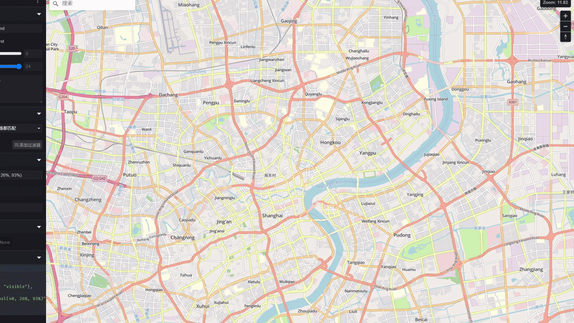
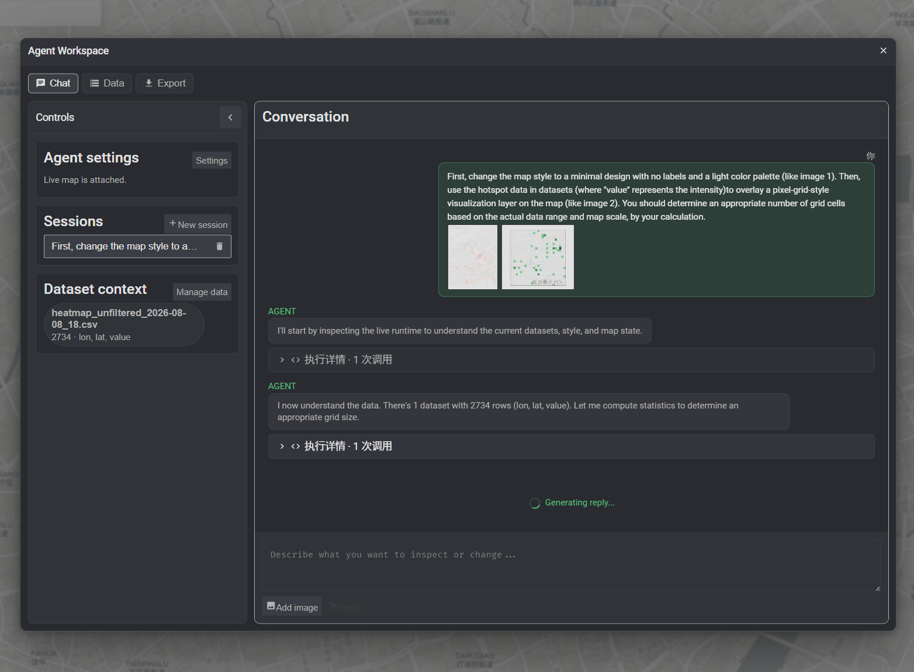

<h1 align="center">Maputnik AI</h1>

<p align="center"><strong>Talk to your map. Turn data into a visualization with one prompt.</strong></p>

<p align="center">
  <a href="#overview">English</a> · <a href="#中文说明">简体中文</a>
</p>

<p align="center">
  
</p>

> **With a single sentence, Maputnik AI turns Shanghai's shopping malls and coffee shops into an interactive map—ready to explore, style, and refine.**

> [!IMPORTANT]
> All data stays local in your browser. Content is only sent out when you explicitly call your configured AI endpoint.

Maputnik AI is an AI-assisted map editor. Choose a base map, import your CSV data, and describe what you want in natural language. The AI can restyle the map, create data visualizations, and help you refine the result in the same editable workspace.

> **Try it online:** [**liuly.moe/Maputnik-AI/**](https://liuly.moe/Maputnik-AI/). The demo does not provide an AI service, so you need to enter your own API key, endpoint, and model in **Agent Settings**.

> [!NOTE]
> Currently, only the **Responses API** is supported. You can use the OpenAI API or any other compatible endpoint.

<a id="overview"></a>

## What you can do

1. Start with an existing map style or import your own.
2. Upload a CSV file as the data source.
3. Ask the AI to change colors, labels, layers, layout, and visual style.
4. Attach a reference image to guide the visual direction.
5. Continue editing through conversation or Maputnik's visual editor.
6. Export the map and data overlay as PNG images.

<table>
  <tr>
    <td width="50%" valign="top">
      
    </td>
    <td width="50%" valign="top">
      
    </td>
  </tr>
  <tr>
    <td align="center"><strong>Edit the live map with natural language</strong></td>
    <td align="center"><strong>Turn data into a visualization</strong></td>
  </tr>
</table>

For example:

> Simplify the base map, then visualize the hotspot data as a green square grid whose color intensity represents the value.

## Run locally

```bash
npm install
npm run start
```

## Background and license

Maputnik AI is an independent experimental fork, not an official MapLibre project. The original Maputnik editor is maintained at [maplibre/maputnik](https://github.com/maplibre/maputnik).

This repository preserves Maputnik's copyright notices and is distributed under the [MIT License](LICENSE).

---

<a id="中文说明"></a>

## 中文说明

<p align="center">
  
</p>

> **只需一句话，Maputnik AI 就能把上海的商场和咖啡店呈现在一张可交互的地图上，让你继续探索、设计和调整。**

> [!IMPORTANT]
> 所有数据都保存在你的浏览器本地。只有在你主动调用已配置的 AI 端点时，内容才会被发送出去。

Maputnik AI 是一个 AI 辅助的地图编辑器。选择一个底图，导入你的 CSV 数据，并用自然语言描述你想要的效果。AI 可以重新设计地图、创建数据可视化，并在同一个可编辑工作区中帮助你完善结果。

> **在线试用：** [**liuly.moe/Maputnik-AI/**](https://liuly.moe/Maputnik-AI/)。演示中未提供 AI 服务，你需要在**代理设置**中输入你自己的 API 密钥、端点和模型。

> [!NOTE]
> 目前仅支持 **Responses API**。你可以使用 OpenAI API 或任何其他兼容的端点。

## 你可以做什么

1. 从现有地图样式开始或导入你自己的样式。
2. 将 CSV 文件上传作为数据源。
3. 要求 AI 更改颜色、标签、图层、布局和视觉样式。
4. 附加参考图像来引导视觉方向。
5. 通过对话或 Maputnik 的可视化编辑器继续编辑。
6. 将地图和数据覆盖层导出为 PNG 图像。

<table>
  <tr>
    <td width="50%" valign="top">
      
    </td>
    <td width="50%" valign="top">
      
    </td>
  </tr>
  <tr>
    <td align="center"><strong>用自然语言编辑实时地图</strong></td>
    <td align="center"><strong>将数据转化为可视化</strong></td>
  </tr>
</table>

例如：

> 简化底图，然后将热点数据可视化为绿色方形网格，其颜色强度代表数值。

## 本地运行

```bash
npm install
npm run start
```

## 背景和许可证

Maputnik AI 是一个独立的实验性分支，不是官方的 MapLibre 项目。原始 Maputnik 编辑器由 [maplibre/maputnik](https://github.com/maplibre/maputnik) 维护。

本仓库保留了 Maputnik 的版权声明，并按 [MIT 许可证](LICENSE)分发。
